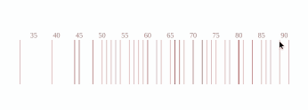

# d3rug: interactive rug plots

d3rug is a R package and function that generates interactive rug plots. 
It is heavily inspired
by the interactive [strip plot of Maarten Lambrechts](). The interactive plot
is a [htmlwidget]() and thus can be used within [RStudio](), [R-markdown]() 
documents and [Shiny]() applications.

## Install

`d3rug` is currently not available on CRAN but can be installed with `devtools` 

```r
devtools::install_github("edwindj/d3rug")
```

## Use

The package contains one function: `d3rug`.

```r
library(d3rug)
income_by_state <- state.x77[,2]
labels <- names(income_by_state)

d3rug( income_by_state
     , labels    = labels
     , col       = "brown"
     , col_hover ="steelblue"
     , alpha     = 0.4
     )
``` 
generate the following plot (the example shown here is a captured animated gif)

